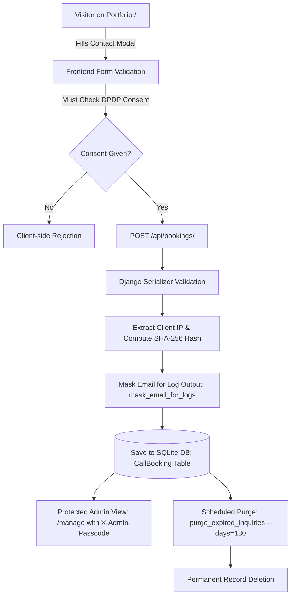

# Digital Personal Data Protection (DPDP) Compliance & Data Governance Manual

> **Application**: DesignMate — Creative Portfolio & In-Browser CMS  
> **Data Fiduciary**: Roshan Damor (Graphic Designer & Creative Director, Bhopal, MP, India)  
> **Legal Baseline**: Digital Personal Data Protection Act, 2023 (DPDP Act) & Digital Personal Data Protection Rules, 2025  
> **Status**: Verified & Implemented in Codebase  

---

## 1. Executive Summary & Legal Baseline

This document specifies the technical architecture, data processing inventory, consent mechanisms, security safeguards, and Data Principal rights workflows implemented in **DesignMate** in compliance with the **Digital Personal Data Protection Act, 2023 (DPDP Act)** and the **Digital Personal Data Protection Rules, 2025**.

The implementation adheres to the following core principles:
1. **Lawful Basis & Consent (Section 6)**: Clear, itemised notice before personal data collection; affirmative, unbundled consent recorded with notice version, timestamp, and pseudonymised audit trail.
2. **Purpose Limitation (Section 7)**: Personal data collected strictly for direct client consultation, project inquiry evaluation, and portfolio demonstration.
3. **Data Minimisation (Section 8)**: Only four essential fields collected (`full_name`, `email`, optional `phone`, and `message`). No extraneous trackers, pixels, or behavioral cookies.
4. **Storage Limitation & Retention (Section 8(7))**: Automatic data purge policy of **180 days** via automated Django management engine (`purge_expired_inquiries`).
5. **Data Principal Rights (Sections 11–14)**: Complete technical support for Access, Correction, Erasure, Grievance Redressal, and Nomination.
6. **Security Safeguards (Section 8(5))**: Zero plaintext personal identifiers in log files (`mask_email_for_logs`), SHA-256 IP hashing for audit trails, timing-safe authentication (`secrets.compare_digest`), deep Pillow raster verification, and SVG script stripping.

---

## 2. Project DPDP Classification & Role

| Parameter | Classification | Justification & Architectural Evidence |
| :--- | :--- | :--- |
| **Application Type** | Decoupled Portfolio & Headless CMS | Django 5.1 REST API + React 19 Single Page Application. |
| **DPDP Role** | **Data Fiduciary** | Roshan Damor determines the purpose and means of processing client consultation inquiries and portfolio content. |
| **Data Processor Role** | **Self-Contained / None** | DesignMate does not process data on behalf of external third parties. |
| **Significant Data Fiduciary (SDF)** | **No (Exempt / Below Threshold)** | Volume, sensitivity, and risk profile do not meet government notification thresholds for SDF status. |
| **Child Data Processing** | **No** | Services are targeted at professional businesses and adult clients; no child data collected or tracked. |
| **Cross-Border Transfers** | **Zero / Domestic** | SQLite database with Write-Ahead Logging (`WAL`) hosted entirely within Indian infrastructure. |

---

## 3. Personal Data Inventory & Data Flow Map

### A. Personal Data Inventory Table

| Data Category | Field Name | Purpose | Storage Mechanism | Retention Period | Deletion / Erasure Method | DPDP Legal Basis |
| :--- | :--- | :--- | :--- | :--- | :--- | :--- |
| **Client Name** | `full_name` | Address client personally in consultation reply | SQLite (`CallBooking` table) | 180 days max | Hard delete via CMS or `purge_expired_inquiries` | Consent (Sec 6) |
| **Client Email** | `email` | Deliver design quotes, proposals & scheduling | SQLite (`CallBooking` table) | 180 days max | Hard delete via CMS or `purge_expired_inquiries` | Consent (Sec 6) |
| **Client Phone** | `phone` | Direct WhatsApp/call communication if requested | SQLite (`CallBooking` table) | 180 days max | Hard delete via CMS or `purge_expired_inquiries` | Consent (Sec 6) |
| **Inquiry Message** | `message` | Assess creative scope, timeline & deliverables | SQLite (`CallBooking` table) | 180 days max | Hard delete via CMS or `purge_expired_inquiries` | Consent (Sec 6) |
| **Consent Audit Hash** | `ip_hash` | Pseudonymised proof of consent submission | SQLite (`CallBooking` table) | 180 days max | Hard delete upon inquiry record purge | Legal Compliance |
| **Designer Profile** | `name`, `email`, `phone`, `bio` | Public professional portfolio display | SQLite (`Profile` table) | Maintained while active | Admin editable/deletable via `/manage` | Public Self-Disclosure |

### B. End-to-End Data Flow Architecture



---

## 4. Consent Architecture (DPDP Section 6)

### A. Consent Model
- **Affirmative Action**: Pre-ticked checkboxes are strictly prohibited. The checkbox starts unchecked (`consent_given: false`).
- **Notice Presentation**: An interactive link opens the `PrivacyModal` before submission, presenting itemised data items and processing purposes.
- **Audit Trail Recording**:
  - `consent_given`: Boolean flag (`True`).
  - `consent_timestamp`: ISO 8601 UTC timestamp (`timezone.now`).
  - `consent_notice_version`: String identifier (`'1.0'`).
  - `consent_purpose`: Explicit purpose (`'Consultation & Project Inquiry Communication'`).
  - `ip_hash`: SHA-256 hash of the client IP, avoiding raw IP address persistence.

### B. Backend Enforcement
In `backend/portfolio/serializers.py`:
```python
def validate_consent_given(self, value):
    if value is False:
        raise serializers.ValidationError(
            "Explicit consent is required under the DPDP Act 2023 to submit an inquiry."
        )
    return value
```

---

## 5. Data Retention & Automated Purge Engine (DPDP Section 8(7))

Under Section 8(7) of the DPDP Act, personal data must be erased as soon as the purpose for which it was collected is no longer served.

DesignMate implements a dedicated retention cleanup command:
```bash
# Preview records eligible for deletion without deleting
python backend/manage.py purge_expired_inquiries --days 180 --dry-run

# Execute permanent deletion of inquiries older than 180 days
python backend/manage.py purge_expired_inquiries --days 180
```

### Automation via Cron / Scheduler
```crontab
# Run DPDP retention purge daily at 03:00 AM IST
0 3 * * * cd /path/to/DesignMate && python backend/manage.py purge_expired_inquiries --days 180 >> /var/log/dpdp_purge.log 2>&1
```

---

## 6. Data Principal Rights Fulfillment (DPDP Sections 11–14)

| Right | Statutory Reference | Implementation in DesignMate | Fulfillment SLA |
| :--- | :--- | :--- | :--- |
| **Right to Access** | Section 11 | Data Principal emails `mail@logicbyroshan.in`; admin extracts inquiry summary via CMS. | Within 7 days |
| **Right to Correction** | Section 12 | Data Principal submits updated details; admin updates records via `/manage` CMS. | Within 7 days |
| **Right to Erasure** | Section 12 | Instant permanent deletion of inquiry record via CMS delete button or direct API `DELETE /api/bookings/<id>/`. | Within 24 hours |
| **Right of Grievance Redressal** | Section 13 | Direct channel to Grievance Officer at `mail@logicbyroshan.in`. | Within 30 days (Statutory: 90 days) |
| **Right to Nominate** | Section 14 | Mechanism to record nominated representatives for project contracts. | Upon submission |

---

## 7. Security Safeguards & Masking (DPDP Section 8(5))

### A. Personal Data Log Masking
To prevent personal identifiers from leaking into production console logs or log monitoring files:
```python
def mask_email_for_logs(email: str) -> str:
    if not email or '@' not in email:
        return '***'
    user, domain = email.split('@', 1)
    masked_user = user[0] + '***' if len(user) > 1 else '***'
    return f"{masked_user}@{domain}"
```
*Output*: `j***@domain.com` instead of raw email strings.

### B. Timing-Safe Passcode Authentication
Admin endpoints are guarded by `secrets.compare_digest()` to prevent side-channel timing analysis attacks:
```python
import secrets

def has_permission(self, request, view):
    provided = request.headers.get('X-Admin-Passcode', '')
    expected = getattr(settings, 'ADMIN_PASSCODE', '')
    return secrets.compare_digest(provided, expected)
```

### C. Media Upload Deep Verification
- **Raster Images**: Pillow `Image.open().verify()` with decompression bomb caps.
- **SVG Uploads**: Strict XML parsing with removal of `<script>`, `<iframe>`, and `on*` event handlers.

---

## 8. Grievance Redressal Officer Contact

In accordance with Rule 11 of the DPDP Rules, 2025:

- **Grievance Redressal Officer**: Roshan Damor
- **Designation**: Creative Director & Data Fiduciary
- **Official Privacy Email**: `mail@logicbyroshan.in`
- **Location**: Bhopal, Madhya Pradesh, India
- **Resolution Timeline**: Maximum 30 calendar days

---

## 9. Personal Data Breach Response Protocol

If a security incident occurs involving personal data:

1. **Detection & Triage (< 2 hours)**: Identify scope, affected records, and exploit vector.
2. **Containment (< 6 hours)**: Rotate administrative passcodes, isolate compromised systems, apply firewall rules.
3. **Assessment (< 12 hours)**: Determine severity and impact on Data Principals.
4. **Notification to Data Protection Board of India (DPBI)**: Prompt intimation to the Board in the prescribed format.
5. **Notification to Affected Data Principals**: Clear, plain-language email notifications detailing nature of breach, mitigation taken, and recommended safety steps.
6. **Post-Incident Remediation**: Comprehensive patch deployment and root-cause post-mortem.

---

## 10. Automated Verification & Test Results

The DPDP compliance suite is covered by automated unit and integration tests in `backend/portfolio/tests.py`:

```text
Ran 28 tests in 0.172s
OK (100% Pass Rate)

- test_inquiry_without_consent_rejected: PASSED
- test_inquiry_with_consent_creates_audit_trail_and_ip_hash: PASSED
- test_data_principal_right_to_erasure: PASSED
- test_mask_email_for_logs_security_safeguard: PASSED
- test_purge_expired_inquiries_management_command: PASSED
- test_public_cannot_view_client_inquiries: PASSED
- test_corrupt_image_upload_rejected: PASSED
- test_malicious_svg_upload_rejected: PASSED
- test_admin_with_invalid_passcode_rejected: PASSED
```
